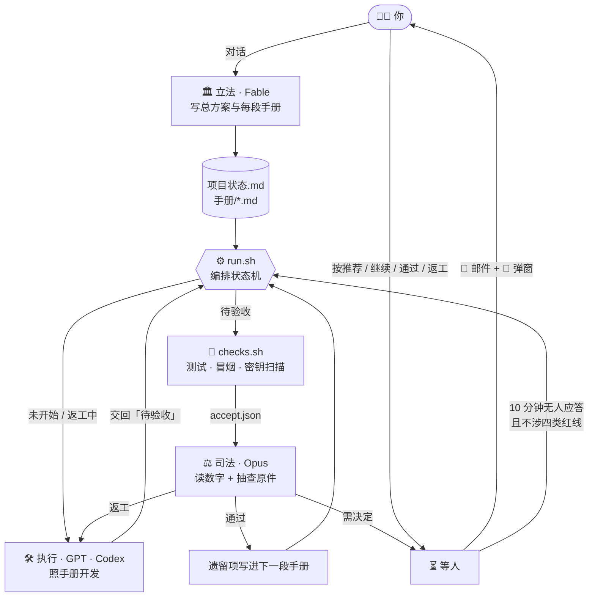
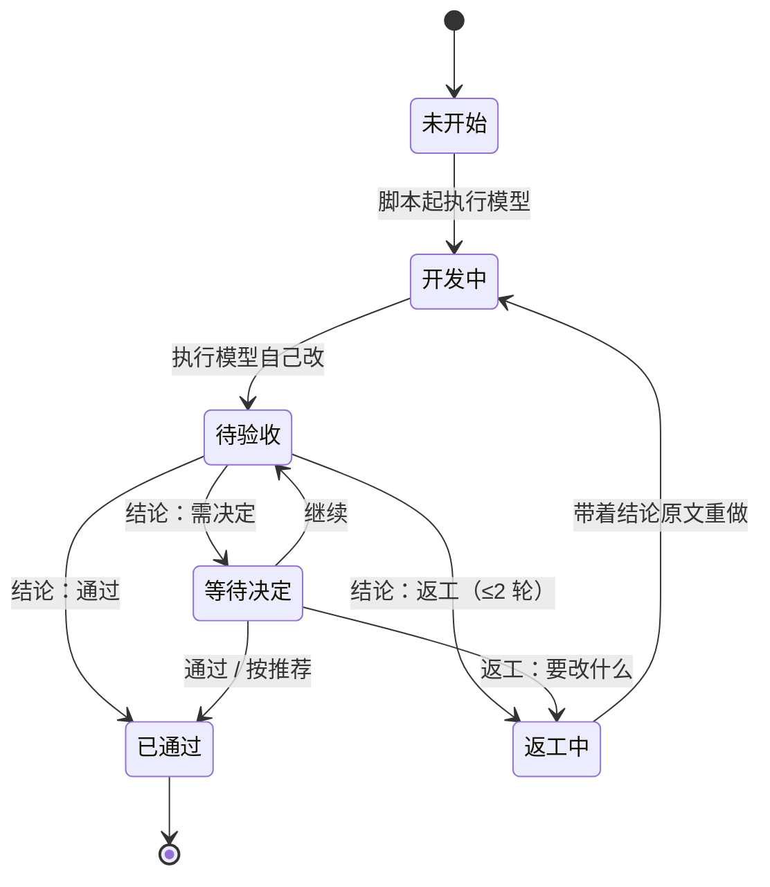

<div align="center">


<h3>我把孟德斯鸠的三权分立，搬进了 AI 编程。</h3>

<p>
一个模型<b>立法</b>（写手册），一个模型<b>执行</b>（写代码），另一家厂商的模型<b>司法</b>（做验收）。<br>
一个两百多行的 bash 脚本让它们无人值守地轮转，卡住了才给你发邮件。
</p>

<p><em>自己写、自己验的模型会给自己放水。分了权，就放不了。</em></p>

<p>
  <a href="#-演示"><b>🎬 看演示</b></a> ·
  <a href="#-30-秒体验"><b>🚀 30 秒体验</b></a> ·
  <a href="#-一行接入"><b>⚡ 一行接入</b></a> ·
  <a href="#-为什么是三权分立">🏛 为什么是三权分立</a> ·
  <a href="#-踩坑博物馆">🧯 踩坑博物馆</a> ·
  <a href="./docs/DESIGN.md">📚 设计文档</a> ·
  <a href="./README_EN.md">English</a>
</p>

<p>
  <a href="https://github.com/wyatttml/trias/stargazers"></a>
  <a href="https://github.com/wyatttml/trias/releases"></a>
  <a href="https://github.com/wyatttml/trias/actions/workflows/e2e.yml"></a>
  <a href="./LICENSE"></a>
  <br>
  
  
  
  
  
  
</p>

</div>

---

## 🎬 演示

<p align="center">
  
</p>

<p align="center"><sub>回放的是 <code>tests/</code> 里用假模型跑出的真实 <code>pipeline.log</code>（节选）。真实运行时，开发与验收分别由 Codex CLI 和 Claude Code 完成。</sub></p>

## ✨ 亮点

| | |
| --- | --- |
| 🏛 **三权分立** | 方案、执行、验收由三个模型分担；执行与验收来自不同厂商，验收不会给自己放水。 |
| 📜 **手册即法律** | 每段工作一份手册，写死「要做 / 不做 / 通过线 / 降级路径」。验收的遗留项自动追加进下一段手册，法律会生长。 |
| 📏 **程序量得出的交给程序** | 测试、冒烟、密钥扫描由脚本跑出数字；验收模型只读数字、抽查 2 到 3 处原件，15 次工具调用以内下结论。 |
| 🔁 **有界返工** | 最多返工 2 轮，第 3 次验收必须裁决，不会无限循环。 |
| 📮 **少打扰** | 只有四类事一定等人：新开付费服务、删数据、改范围、改密钥配置。其余 10 分钟没人答就按推荐办。 |
| 🧯 **可接管、可停止** | 进程重启会等正在跑的模型做完再接手；`touch 停止` 文件即可安全停下，从不 `pkill`。 |
| 🔌 **每一块都能换** | 换模型、换通知渠道、换语言、换成非代码项目，都只改一个函数或一个文件。 |

## 🏛 为什么是三权分立

一个模型从头干到尾，等于让同一个人立法、执法、判案。Trias 把三种权力拆给三个角色，并让它们互相够不着对方的手：

| 权力 | 谁 | 产出 | 被谁制衡 |
| --- | --- | --- | --- |
| **立法** | Fable（方案模型，对话里用） | 总方案与每段手册：要做、不做、通过线、降级路径 | 不碰代码；通过线必须能用程序量出来 |
| **执行** | GPT · Codex CLI | 代码、测试、冒烟脚本、交付说明 | 不改流水线、不碰 Git；唯一能改的状态是交回「待验收」 |
| **司法** | Claude Opus | 三选一结论：通过、返工、需决定 | 不改代码；只认程序跑出的数字；第 3 次必须裁决 |
| **主权在民** | 你 | 四类红线上的最终决定 | 10 分钟不回，非红线事项按推荐自动执行 |

和其他做法比：

| | 单模型从头干到尾 | 多智能体框架 | **Trias** |
| --- | --- | --- | --- |
| 谁来验收 | 它自己 | 框架内的另一个角色 | **另一家厂商的模型，只读程序跑出的数字** |
| 状态存在哪 | 对话上下文 | 框架运行时 | **磁盘上的 Markdown 进度表，重启可接管** |
| 你怎么介入 | 盯着终端 | 看框架界面 | **收邮件，点「按推荐办」** |
| 依赖 | 编码工具本身 | Python 包与运行时 | **bash + python3 标准库** |
| 换一个模型 | 换工具 | 改适配层 | **改一个 shell 函数** |

## 🏗 架构



<details>
<summary><b>状态机</b>（点击展开）</summary>



</details>

## 🚀 30 秒体验

不需要任何 API Key。自测用假模型在临时目录里跑完整闭环，4 个场景、20 条断言：

```bash
git clone https://github.com/wyatttml/trias.git && cd trias
bash tests/e2e.sh
```

<details>
<summary>输出（点击展开）</summary>

```text
场景一：开发 → 程序检查 → 验收 → 返工一轮 → 通过 → 遗留追加 → 亲验标记 → 全部完成
  ✓ S1、S2 记为已通过
  ✓ S3 记为已通过·待 AI 产品经理亲验
  ✓ 执行模型自己交回「待验收」，无需流水线代改
  ✓ S2 被判返工一次并重做
  ✓ 返工提示词带着验收结论原文
  ✓ S1 的遗留项追加进 S2 手册
  ✓ S2 的遗留项追加进 S3 手册
  ✓ 发出「全部完成」通知
  ✓ 没有残留的等待或返工文件
场景二：验收判需决定 → 弹窗 + 邮件 → 再提醒 → 无人回应 → 自动按推荐通过
  ✓ 发出「等你决定」通知
  ✓ 发出「再提醒一次」通知
  ✓ 发出「已自动按推荐办」通知
  ✓ S1 按推荐判为已通过
  ✓ 弹窗至少弹了首次与再提醒两次
场景三：程序检查——密钥泄露会被扫出来，且值不出现在结果里
  ✓ secret_hits 大于 0
  ✓ 结果文件不含密钥本身
场景四：一行安装——新增文件、重复安装不覆盖、.gitignore 不重复追加
  ✓ 流水线脚本与模板都已装好
  ✓ 第二次安装不覆盖已有文件
  ✓ .gitignore 各项只出现一次
  ✓ 不会创建 .env

全部通过
```

</details>

## ⚡ 一行接入

在你的项目根目录：

```bash
curl -fsSL https://raw.githubusercontent.com/wyatttml/trias/main/install.sh | bash
```

它只做三件事：把 `pipeline/` 和模板拷进来；已存在的文件一律跳过；往 `.gitignore` 补上 `.env` 和 `运行数据/`。不创建 `.env`，不碰你的代码。

然后：

1. **立法**：让方案模型照 `手册/_模板_Sn_子阶段名.md` 写 `手册/00_总方案.md` 和 `手册/S1_xxx.md … Sn_xxx.md`，并把子阶段填进 `项目状态.md`。
2. **接检查**：把 `pipeline/checks.sh` 里的测试命令换成你的，手跑一次 `bash pipeline/checks.sh S1`。
3. **开跑**：

```bash
nohup caffeinate -dims bash pipeline/run.sh >> 运行数据/pipeline/日志/nohup.out 2>&1 &
```

前置条件：已登录的 [Codex CLI](https://github.com/openai/codex) 和 [Claude Code](https://github.com/anthropics/claude-code)。Linux 去掉 `caffeinate -dims`。要停下：`touch 运行数据/pipeline/停止`。完整清单见 [DESIGN.md 第 14 节](./docs/DESIGN.md#14-复刻清单照着做约一小时)。

## 📮 你会收到什么

| 事件 | 邮件标题 | 要你做什么 |
| --- | --- | --- |
| 验收通过 | `S2 检索接口 验收通过` | 不用 |
| 判返工 | `S2 检索接口 判返工（第 1 次验收）` | 不用 |
| 需决定 | `流水线停了，等你决定（S2）` | 点弹窗「按推荐办」，或在决定文件写一个词 |
| 自动按推荐 | `已自动按推荐办（S2）` | 不用 |
| 全部完成 | `流水线全部完成` | 去总验 |

Gmail 开箱即用，Slack、飞书、企业微信机器人在 `.env` 里加一行就能收。

## 🧯 踩坑博物馆

Trias 的每一条规则，都对应一次真实事故。挑三件：

> **🌀 死循环：同一个故障被反复重跑，弹窗一次接一次。**
> 检查脚本把结果写到了别的目录，编排脚本以为没跑完；AI 产品经理每次都点「按推荐办」，它就每次重跑同一个故障。
> → 现在：结果文件缺失只自动重试一次，同一原因第二次出现就停下一直等人。

> **💸 一句「不花钱」，检索命中率停在 29%。**
> 规则里写了不许花钱，执行模型就把向量化整个跳过了。
> → 现在：费用授权写进提示词；因为省钱跳过真实调用的，验收直接判返工。

> **🧪 前四段的首轮验收，全部返工。**
> 执行模型只跑了相关测试，把旧测试改坏留给了验收。
> → 现在：提示词写死「收尾前必须完整跑一遍全量测试，全绿再交」。

另外 8 件见 [DESIGN.md 第 11 节](./docs/DESIGN.md#11-踩过的坑真实事故已在脚本里修)。

## 🗂 仓库结构

```text
pipeline/
├─ run.sh            编排状态机（单线参考实现）
├─ state.py          读写进度表
├─ notify.py         Gmail + webhook 通知
├─ checks.sh         程序检查，唯一需要按项目改的文件
└─ prompts/          开工 · 返工 · 验收 三份提示词
templates/           项目状态 · 手册章节 · AGENTS.md · 故障说明 · .env 样例
install.sh           一行接入
docs/DESIGN.md       完整设计：原理、提示词与脚本全文、11 条踩坑、DIY 替换表
tests/e2e.sh         假模型端到端自测，CI 在 macOS 与 Linux 上跑
assets/              横幅、终端回放、社交预览图
```

## 💡 设计原则

1. **用文件交接，不用聊天交接。** 手册是法律，验收结论是判决书，进度表是唯一事实。
2. **脚本是唯一的状态推进者。** 模型只干活，不推进流程。
3. **通过线必须可量。** 量不出来的写进「完成定义」由验收抽查；不要靠加审核环节弥补。
4. **流程增加人的操作而不提升成品，就是自嗨。** 每加一个确认点前先问：这一步让成品更好，还是只让流程更长？

<details>
<summary><b>❓ 常见问题</b></summary>

**为什么不让一个模型从头干到尾？**
自己验收自己会放水。换一家厂商的模型验收，并且让它只读程序跑出来的数字，判断才可重复。

**为什么不加更严的审核？**
真实经验是越重越假：每段写网页自动点击检查、重跑前序阶段，验收时间翻倍，成品没有变好。先把通过线写得可量。

**能用在非代码项目上吗？**
能。把 `checks.sh` 换成格式校验、字数、必含章节这类能量出来的检查，冒烟改成「真实产出一件成品」。

**执行模型想换成 Claude、验收换成 GPT 呢？**
改 `run_codex` 和 `run_claude` 两个函数即可，提示词不用动。见 [DIY 替换表](./docs/DESIGN.md#13-diy-替换表)。

**能并行吗？**
可以开多条 git worktree 并行，真实项目就是两线跑完的，但编排脚本会从两百多行涨到 550 行。建议先单线跑通。要点见 [DESIGN.md 第 12 节](./docs/DESIGN.md#12-进阶两线并行可选第一版不要做)。

**Windows？**
用 WSL。

</details>

## 📚 深入阅读

[`docs/DESIGN.md`](./docs/DESIGN.md) 是完整的设计文档：为什么这样分工、状态机、手册写法、等人机制、通知设计、三份提示词与四份脚本全文、11 条真实事故与防法、DIY 替换表、一小时复刻清单、费用与额度。

欢迎提 Issue 和 PR，约定见 [CONTRIBUTING.md](./CONTRIBUTING.md)。

## ⭐ Star 曲线

<a href="https://star-history.com/#wyatttml/trias&Date">
  
</a>

## 📄 License

[MIT](./LICENSE)
