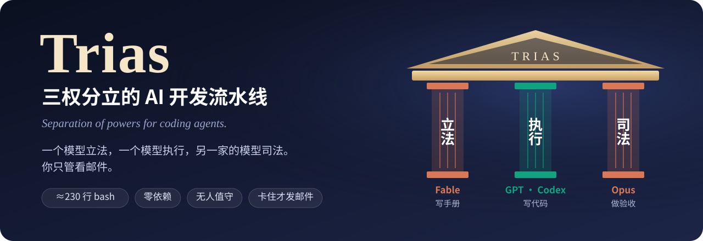
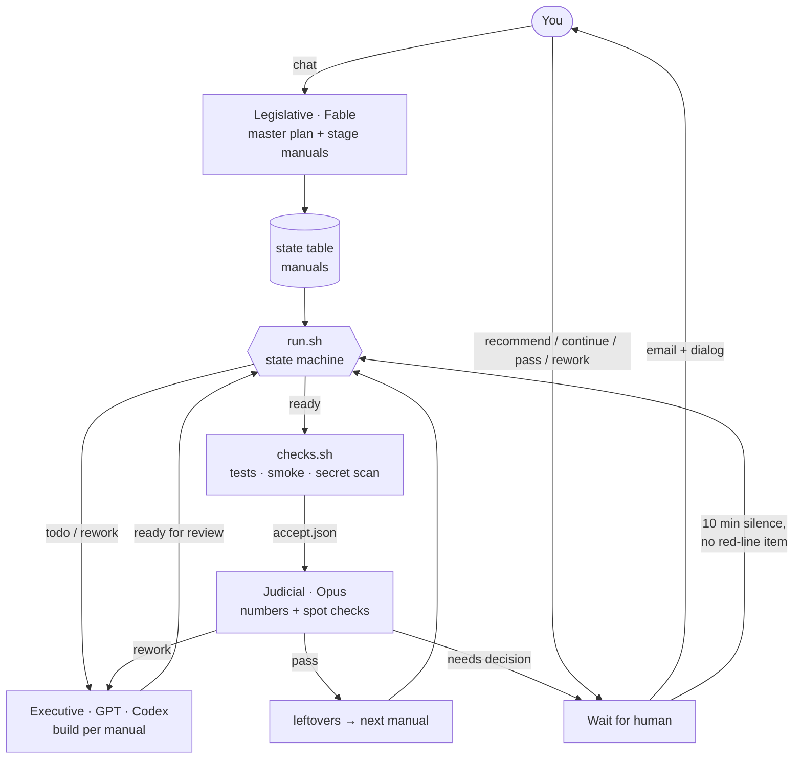

<div align="center">



<h3>Montesquieu, but for coding agents.</h3>

<p>
One model <b>legislates</b> (writes the manuals). One model <b>executes</b> (writes the code). A model from <b>another vendor</b> <b>judges</b> (reviews).<br>
A ~230-line bash state machine rotates them unattended, and only emails you when it is stuck.
</p>

<p><em>A model that writes and grades its own work will go easy on itself. Split the powers and it can't.</em></p>

<p>
  <a href="#-demo"><b>🎬 Demo</b></a> ·
  <a href="#-try-it-in-30-seconds"><b>🚀 Try it in 30s</b></a> ·
  <a href="#-one-line-install"><b>⚡ One-line install</b></a> ·
  <a href="#-why-separation-of-powers">🏛 Why separation of powers</a> ·
  <a href="#-incident-museum">🧯 Incident museum</a> ·
  <a href="./README.md">中文</a>
</p>

<p>
  <a href="https://github.com/wyatttml/trias/stargazers"></a>
  <a href="https://github.com/wyatttml/trias/releases"></a>
  <a href="https://github.com/wyatttml/trias/actions/workflows/e2e.yml"></a>
  <a href="./LICENSE"></a>
  
  
  
</p>

</div>

---

## 🎬 Demo

<p align="center">
  
</p>

<p align="center"><sub>A replay (excerpt) of a real <code>pipeline.log</code> produced by the fake models in <code>tests/</code>. In real runs, building and reviewing are done by Codex CLI and Claude Code. The log text is in Chinese because the original project was.</sub></p>

## ✨ Highlights

- **Separation of powers.** Planning, building and reviewing are split across three models; builder and reviewer come from different vendors.
- **Manuals are law.** Each stage has a manual with scope, non-goals, pass lines and a fallback path. Review leftovers are appended to the next manual automatically.
- **Measure with code, judge with models.** Tests, smoke runs and secret scans produce numbers; the reviewer reads the numbers, spot-checks 2–3 artifacts, and decides within 15 tool calls.
- **Bounded rework.** At most two rework rounds; the third review must rule.
- **Minimal interruptions.** Only four things always wait for a human: new paid services, deleting data, changing scope, touching secrets. Everything else auto-resolves after 10 minutes.
- **Safe stop and takeover.** `touch` a stop file to halt; a restarted orchestrator waits for the in-flight builder instead of starting over. Never `pkill`.
- **Swap anything.** Models, notification channels, languages, even non-code projects — one function or one file each.

## 🏛 Why separation of powers

| Power | Who | Produces | Checked by |
| --- | --- | --- | --- |
| **Legislative** | Claude Fable (in chat) | Master plan and per-stage manuals | Never touches code; pass lines must be machine-measurable |
| **Executive** | GPT · Codex CLI | Code, tests, smoke scripts, delivery notes | Can't edit the pipeline or Git; its only state change is "ready for review" |
| **Judicial** | Claude Opus | One of: pass / rework / needs decision | Never edits code; trusts only machine-produced numbers; must rule on round 3 |
| **The people** | You | Final say on four red lines | Silence for 10 min = recommended option, for non-red-line items |

| | One model end to end | Multi-agent frameworks | **Trias** |
| --- | --- | --- | --- |
| Who reviews | Itself | Another role inside the framework | **A different vendor's model, reading machine numbers only** |
| Where state lives | Chat context | Framework runtime | **A Markdown table on disk; restart-safe** |
| How you step in | Watch the terminal | Framework UI | **Read an email, click "go with recommendation"** |
| Dependencies | The coding tool | Python packages and runtime | **bash + python3 stdlib** |
| Swap a model | Switch tools | Rewrite an adapter | **Edit one shell function** |

## 🏗 Architecture



## 🚀 Try it in 30 seconds

No API keys needed. The self-test runs the full loop with fake models — 4 scenarios, 20 assertions:

```bash
git clone https://github.com/wyatttml/trias.git && cd trias
bash tests/e2e.sh
```

## ⚡ One-line install

From your project root:

```bash
curl -fsSL https://raw.githubusercontent.com/wyatttml/trias/main/install.sh | bash
```

It copies `pipeline/` and the templates in, skips anything that already exists, and adds `.env` and `运行数据/` to `.gitignore`. It never creates `.env` or touches your code. Then have the planner write the manuals, point `pipeline/checks.sh` at your test command, and start:

```bash
nohup bash pipeline/run.sh >> 运行数据/pipeline/日志/nohup.out 2>&1 &
```

Prerequisites: logged-in [Codex CLI](https://github.com/openai/codex) and [Claude Code](https://github.com/anthropics/claude-code). On macOS, prefix with `caffeinate -dims` to keep the machine awake.

## 🧯 Incident museum

Every rule in Trias comes from something that actually broke:

> **🌀 An endless loop, one popup after another.** The check script wrote results to the wrong directory; the orchestrator thought the run was unfinished and retried forever while the product owner kept clicking "go with recommendation".
> → Now: a missing result is retried once; the same cause twice means stop and wait for a human.

> **💸 "Don't spend money" froze retrieval accuracy at 29%.** The builder skipped embeddings entirely to save cost.
> → Now: cost authorization lives in the prompt, and skipping required real calls is an automatic rework.

> **🧪 The first four stages all failed their first review.** The builder only ran related tests and broke old ones.
> → Now: the prompt requires a full test run, all green, before handing back.

Eight more in [DESIGN.md §11](./docs/DESIGN.md#11-踩过的坑真实事故已在脚本里修) (Chinese).

## 💡 Design principles

1. Hand off through files, not chat.
2. The script is the only thing that advances state.
3. Pass lines must be measurable.
4. A step that adds human work without improving the output is theater.

## 📚 Docs

[`docs/DESIGN.md`](./docs/DESIGN.md) (Chinese) covers the full design: roles, state machine, manual format, the wait-for-human protocol, notifications, all prompts and scripts verbatim, 11 real incidents and their fixes, a swap-anything table, and a one-hour setup checklist. Contributions welcome — see [CONTRIBUTING.md](./CONTRIBUTING.md).

## ⭐ Star history

<a href="https://star-history.com/#wyatttml/trias&Date">
  
</a>

## License

[MIT](./LICENSE)
